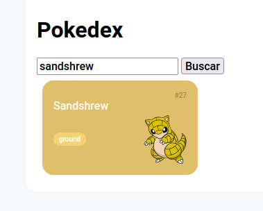

# Entendendo o Desafio - Pokedex
Entenda a importância do Git/GitHub nos Desafios de Projeto da DIO, além de explorar o mundo Pokémon através do consumo de uma API REST para a criação de uma Pokédex incrível! Para isso, você irá explorar, além do JavaScript, todos os fundamentos de desenvolvimento Web aprendidos até aqui.

Agora é sua hora de brilhar! Explore todos os conceitos que aprendemos nesta imersão e replique (ou melhore) este projeto prático. Para isso, use seu próprio repositório no GitHub e, com isso, aumente ainda mais seu portfólio de projetos!

Dica: você pode dar um "fork" no Repositório do GitHub (App) para organizar suas alterações e evoluções, mantendo uma referência direta ao código original.

Foi adicionado ao projeto uma funcionalidade de pesquisa para permitir que os usuários encontre o Pokémon específico.

